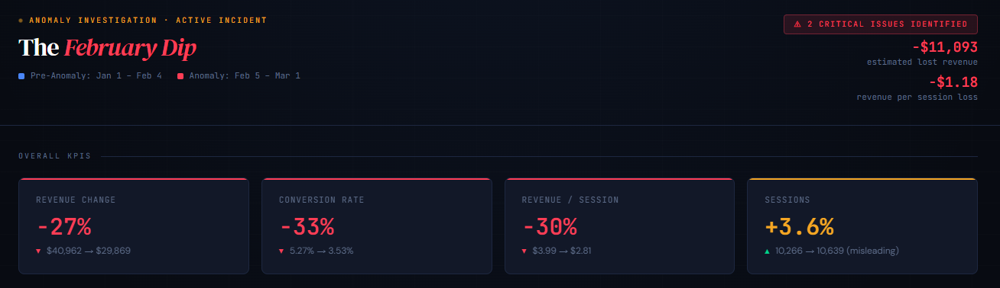
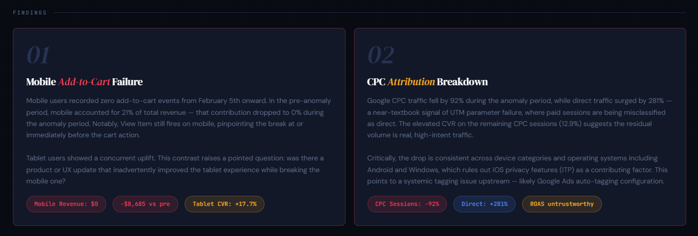

# Data Discrepancy Investigation Project

## Background

**Took on the role of -** Data / Web Analyst  
**Tools used -** Google Analytics 4 · BigQuery · SQL · Excel

**Scenario** - In early February 2024, revenue dropped unexpectedly and the business needed to understand why and fast. Working directly with the raw GA4 BigQuery export (no GA4 UI access), I conducted a full funnel investigation across 61 days of event-level data (~113k rows) to identify the root cause and quantify the impact.

## Approach

Following was the methodology adopted to tackle the problem:

1. **Setting the baseline & trend** → I first established the pre-anomaly period KPIs (sessions, purchases, CVR, revenue) and pinpointed the exact date the decline began using a 7-day rolling average

2. **Breaking down the data by traffic source** → The overall aggregates were broken down by channel and compared the session share across both periods to detect any anomalies in channel mix

3. **Funnel Analysis** → In the next step, built a session-level funnel (session_start → view_item → add_to_cart → begin_checkout → purchase) for both periods side by side to locate the drop-off

4. **Device segmentation** → Cut the funnel by device category to isolate whether the issue was universal or segment-specific

## Root Causes

Two independent issues emerged, both starting **February 5th**:

**1. Mobile add-to-cart failure**  
Mobile users (≈30% of sessions) recorded zero add-to-cart events from Feb 5 onward, eliminating an entire revenue-generating segment. Desktop and tablet behaviour was unaffected, pointing to a device-specific bug likely introduced in a code or UX release around that date.

**2. CPC attribution breakdown**  
Google CPC traffic fell by ~92% while direct traffic surged ~281% indicating an UTM parameter failure where paid sessions were misclassified as direct. The drop was consistent across all device categories and operating systems, ruling out iOS privacy features (ITP) and confirming a systemic tagging issue upstream in Google Ads.

**Combined impact:** Revenue per session dropped from $4.00 → $2.80, with an estimated **$11,000 in lost revenue** over the anomaly period.

## Recommended Fixes

| Priority | Issue | Action |
|---|---|---|
| 🔴 Critical | Mobile add-to-cart broken | QA the add-to-cart interaction on mobile across browsers and OS versions. Cross-reference any code releases made around Feb 5th |
| 🔴 Critical | CPC traffic untagged | Audit Google Ads auto-tagging settings and verify UTM parameters are appending correctly at the campaign level |
| 🟡 Preventive | Single point of failure in attribution | Add manual UTM parameter backups to all paid search ads as a fallback to auto-tagging |
| 🟡 Preventive | No early warning system | Set up anomaly alerts for >50% WoW shifts in any source/medium, and a dedicated alert for mobile add-to-cart rate |